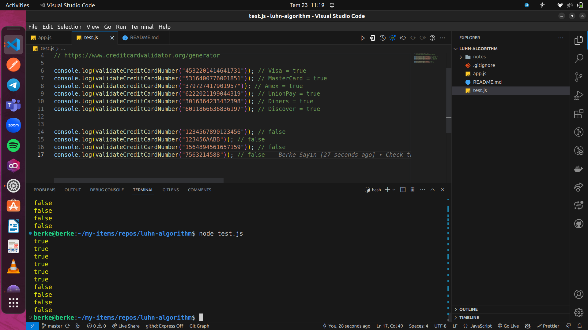

# Kredi Kartı Numarası Validasyonu İçin Luhn Algoritması Kullanımı 


[The Luhn Algorithm for Credit Card Validation](https://www.creditcardvalidator.org/articles/luhn-algorithm)

Luhn Algoritması, kredi kartı numaralarının doğruluğunu kontrol etmek için kullanılan bir algoritmadır. 


[Fake Credit Card Number Generator](https://www.creditcardvalidator.org/generator)

Bu tool'u, seçilen kart sistemine bağlı olarak geçerli IIN'ler kullanan rastgele kredi kartı numaraları oluşturmak ve Luhn Algoritması validasyonunu test etmek için kullanabilirsiniz.

### Contents 

* [Luhn Algoritması Nedir?](#luhn)
* [Kredi Kartı Numarası İçin Validasyon Fonksiyonu](#function)
* [Fonksiyonun Kredi Kartı Değerleri İle Test Edilmesi](#test)
* [Sonuç](#result)

### Luhn Algoritması Nedir? <a name="luhn"></a>

- Luhn Algoritması, kredi kartı numaralarının doğruluğunu kontrol etmek için kullanılan bir algoritmadır. Luhn algoritması 1954 yılında IBM’de çalışan bir bilim insanı olan Hans Peter Luhn tarafından geliştirilmiştir. Kredi kartı numaralarının yazım hatalarını veya basit hataları yakalamak için kullanılır.

### Kredi Kartı Numarası İçin Validasyon Fonksiyonu <a name="function"></a>

`app.js: validateCreditCardNumber()`

```js
// Validation For Credit Card Numbers Using Luhn Algorithm

const validateCreditCardNumber = (input) => {
  // Kredi kartı numarasını sayısal bir diziye dönüştürme
  let creditCardInt = input.split("").map(Number);

  // Luhn Algoritması gereği her ikinci basamağı sondan başlayarak ikiyle çarparız
  for (let i = creditCardInt.length - 2; i >= 0; i = i - 2) {
    // Seçilen her ikinci basamağı geçici bir değişkende saklarız
    let tempValue = creditCardInt[i];

    // Seçilen basamağı ikiyle çarparız
    tempValue = tempValue * 2;

    /* Eğer ikiyle çarpma sonucu elde edilen değer 9'dan büyükse 
        sonuç iki basamaklı bir sayı olacağından dolayı basamaklar toplanarak düzeltilir */
    if (tempValue > 9) {
      tempValue = (tempValue % 10) + 1;
    }

    // Düzeltme yapılan değerin orjinal dizideki ilgili basamağın üzerine yazılması
    creditCardInt[i] = tempValue;
  }

  // Tüm basamakların toplamınının hesaplanması
  let total = 0;
  for (let i = 0; i < creditCardInt.length; i++) {
    total += creditCardInt[i];
  }

  /* Toplamın 10'a bölümünden kalanı kontrol edilmesi ve kredi kartı numarasının geçerli 
        olup olmadığının belirlenmesi */
  return total % 10 === 0;
};

module.exports = validateCreditCardNumber;

```


### Fonksiyonun Kredi Kartı Değerleri İle Test Edilmesi <a name="luhn"></a>

`test.js`

```js
const validateCreditCardNumber = require('./app');

// Bu tool ile Credit Card Numarası Üretip Fonksiyonu Test Edebiliriz
// https://www.creditcardvalidator.org/generator

console.log(validateCreditCardNumber("4532201414641731")); // Visa = true
console.log(validateCreditCardNumber("5316400776001851")); // MasterCard = true
console.log(validateCreditCardNumber("379727417901957")); // Amex = true
console.log(validateCreditCardNumber("6222021199044319")); // UnionPay = true
console.log(validateCreditCardNumber("3016364233432398")); // Diners = true
console.log(validateCreditCardNumber("6011866636836197")); // Discover = true


console.log(validateCreditCardNumber("1234567890123456")); // false
console.log(validateCreditCardNumber("123456AABB")); // false
console.log(validateCreditCardNumber("1564894561657159")); // false
console.log(validateCreditCardNumber("7563214588")); // false
```

### Sonuç <a name="result"></a>

- validateCreditCardNumber() fonksiyonu ile değerlerin test edilmesi 


